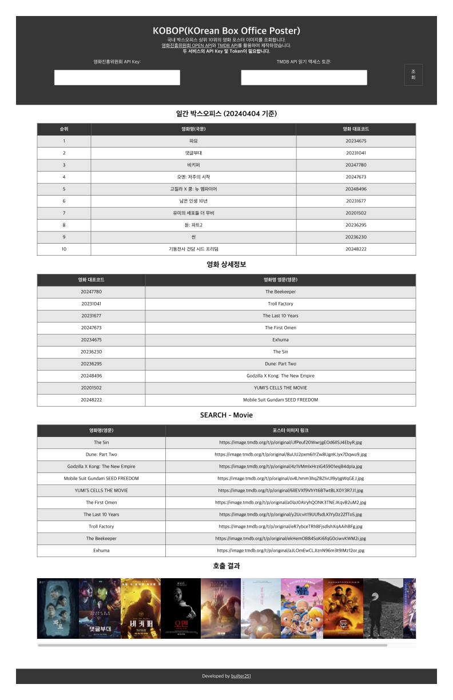

# KOBOP (KOrean Box Office Poster) - 한국 박스오피스 영화 포스터 이미지 조회
국내 박스오피스 상위 10위의 영화 포스터 이미지를 호출합니다.

## 결과 예시

## 사전 요구사항
- [영화진흥위원회 OPEN API Key](https://www.kobis.or.kr/kobisopenapi/homepg/main/main.do)
- [TMDB API 읽기 액세스 토큰](https://developer.themoviedb.org/docs/getting-started)

## 사용 방법
해당 리포지토리 clone 또는 ZIP 다운로드 후 index.html을 통해 사용

## 동작 원리
1. "영화진흥위원회 OPEN API - 일별 박스오피스"에서 순위/영화명(국문)/영화 대표코드를 받습니다.
2. "영화진흥위원회 OPEN API - 영화 상세정보"에서 영화 대표코드로 영화명(영문)을 받습니다.
3. "TMDB API - SEARCH Movie"에서 영화명(영문)으로 포스터 이미지 링크를 받습니다.

## 추후 목표
1. 블로그 후기 작성
2. Netlify 배포

## 제작 후기
(블로그 포스트 추가 예정)